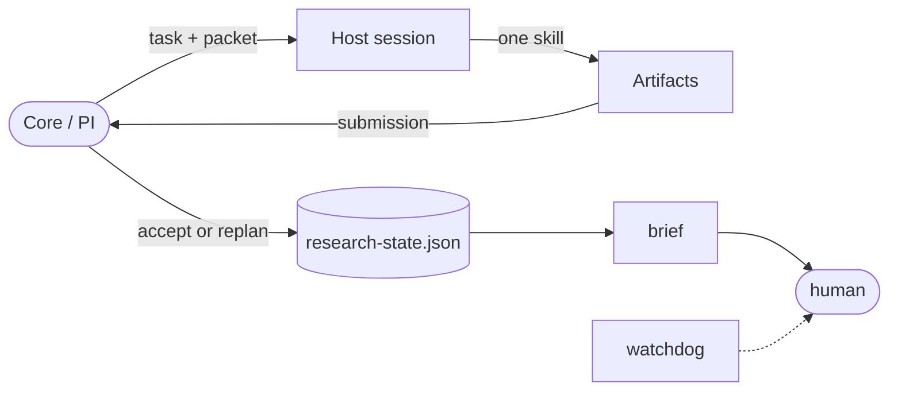

# Virtual Research Group


A virtual research group for AI agents. One core decision maker — the PI — assigns bounded, contract-checked tasks to a flat crew of 26 specialist skills. The core owns the question, the gates and the acceptance decision; a specialist performs only its assigned technical work and returns artifacts or blockers.

Where most research-agent projects try to *automate* research, this one **governs** it: experiments need a frozen protocol and a scoped grant, claims need an evidence audit, external calls need a preflight check, and every decision is recorded.

## Why

Autonomous research agents fail in predictable ways: they swap models silently, rerun a failed experiment with a different seed, promote an exploratory number into a conclusion, or invent a citation. This framework makes those moves structurally hard.

- **One decision layer.** Only the core selects hypotheses, phases, skills, roles, models, permissions, output paths and acceptance criteria; a specialist may never select another skill, spawn an agent, change a model or advance a phase.
- **Bounded contracts.** Work is a `task` plus a fingerprinted `assignment packet` plus a `receipt` of actual execution facts; nothing runs on prose.
- **Evidence before conclusions.** Experiments require research mode, a scoped grant, four evaluation fields and a frozen protocol; conclusions require a verified audit binding `findings.md`, the protocol and raw artifacts by path and hash. Decision history is append-only and state writes are atomic.

## How it works



1. **Register** a bounded task: objective, activity (`analysis` / `experiment` / `conclusions`), one skill, one role, acceptance criteria.
2. **Assign** a packet with evidence hashes, fresh output paths, requested model and session mode.
3. **Accept** a receipt filled from observed facts — actual model, session ID, acceptance time.
4. **Execute** in the host session; every external call is preflight-checked against task, packet, server, operation and scope.
5. **Submit**, then let the core accept, replan or reject.

The host executes; the core owns acceptance and the next decision.

## What it guarantees

| Guarantee | Mechanism |
|---|---|
| No silent substitution | Missing isolation, unavailable models and failed resume return to the core |
| No protocol drift | `set-protocol` freezes a path and hash; a mismatch is a blocker |
| No unverified conclusions | `conclusions` requires a verified audit whose subjects are path/hash pairs |
| No contaminated exploration | `scratch/` artifacts may inform work but are barred from verified claims |
| No unaudited external calls | `check-tool` issues a preflight token; `tool-call` records the call |
| Real independence | `independent_review` is set at creation, forces a fresh session, never dropped |
| Honest self-check | `reflect` records a prediction; `review-reflection` compares it to later results |

## Install

This repository is a directory of skill documents, not a Python package: there is no module to build and `pip install .` is not supported. Clone it into the skills directory of the agent you use.

```bash
git clone https://github.com/Yanghuoshan/virtual-research-group.git ~/.claude/skills/virtual-research-group
```

Use your agent's own skills directory instead: `~/.codebuddy/skills/` for CodeBuddy, `.claude/skills/` inside a repository for a project-level install, or whatever path your agent documents for user skills. Publishing under a different account? Replace `Yanghuoshan` in the command above and in the badge URL.

**Requirements:** Python 3.10+ (tested on 3.10 and 3.12), standard library only, no build step.

```bash
python3 <install-path>/scripts/research.py validate
python3 -m unittest discover -s <install-path>/tests
```

The directory name need not match the `name` in `SKILL.md`, but keep it stable so updating is just `git pull`. Hosts read the frontmatter `name`, so an install cloned under an earlier directory name keeps working. Updating never touches a research project directory.

## Agent quick install

Paste this prompt to any coding agent to have it install and verify the bundle:

```text
Install the Virtual Research Group skill bundle into this agent's user skills directory.

1. Clone https://github.com/Yanghuoshan/virtual-research-group.git into the
   skills directory this agent documents for user skills (~/.claude/skills/ for
   Claude Code, ~/.codebuddy/skills/ for CodeBuddy), keeping the directory name
   virtual-research-group.
2. Run `python3 <install-path>/scripts/research.py validate` and
   `python3 -m unittest discover -s <install-path>/tests`. Both must pass.
3. Report the install path and the validation output.

Do not create a research project, run any skill, start an experiment, install
packages, or change agent configuration. If a step fails, stop and report the
error instead of improvising.
```

The closing instruction is the point: installation is read-only with respect to research. Replace `Yanghuoshan` if you publish under another account.

## Quick start

```bash
python3 scripts/research.py init --project ./projects/graph-study \
  --question "How do graph perturbations affect inductive generalization?"

python3 scripts/research.py task --project ./projects/graph-study --task t1 \
  --objective "Compare explanations" --activity analysis \
  --skill brainstorming-research-ideas --role strategist \
  --acceptance "Each candidate names a mechanism and falsifier"

python3 scripts/research.py handoff --project ./projects/graph-study --task t1 \
  --model current --summary "Develop candidates" \
  --evidence research-brief.md --outputs hypotheses/candidates-v1.md --session fresh

python3 scripts/research.py status --project ./projects/graph-study
```

Initialization creates only the four root documents; `assign` composes packet and receipt for small work, `submit` closes a task, and `brief` rewrites the brief block mechanically. Full command set: [operations](references/operations.md).

## Repository layout

| Entry | Responsibility |
|---|---|
| [SKILL.md](SKILL.md) | Authoritative core decisions, phases, workspace, evidence gates, handoffs |
| [skills/](skills/) | Flat namespace of specialist skills: inputs, method, outputs, checks, boundary |
| [references/](references/) | Supporting explanations and operator instructions |
| [templates/](templates/) | Runtime state, findings, log, audit and acceptance receipt |
| [scripts/research.py](scripts/research.py) | Deterministic helpers for explicit core decisions; no dispatch |
| [tests/](tests/) | Architecture, lifecycle, session policy, evidence integrity, tool semantics |

Extensions go under [extensions/](extensions/) under the same contract; [framework.json](framework.json) mirrors the phase contract.

## Specialist skills

The 26 direct entries cover:

<details>
<summary><strong>Expand the catalog</strong></summary>

**Ideation** — [brainstorming-research-ideas](skills/brainstorming-research-ideas/SKILL.md), [creative-thinking-for-research](skills/creative-thinking-for-research/SKILL.md)

**Literature** — [literature-review](skills/literature-review/SKILL.md), [citation-verification](skills/citation-verification/SKILL.md)

**Design and code** — [experimental-design](skills/experimental-design/SKILL.md), [research-implementation](skills/research-implementation/SKILL.md)

**Execution and data** — [experiment-execution](skills/experiment-execution/SKILL.md), [data-processing](skills/data-processing/SKILL.md), [statistical-analysis](skills/statistical-analysis/SKILL.md)

**Domain evaluation** — [graph-evaluation](skills/graph-evaluation/SKILL.md), [vision-evaluation](skills/vision-evaluation/SKILL.md), [robotics-evaluation](skills/robotics-evaluation/SKILL.md), [symbolic-verification](skills/symbolic-verification/SKILL.md), [scientific-surrogate-validation](skills/scientific-surrogate-validation/SKILL.md), [llm-evaluation](skills/llm-evaluation/SKILL.md), [code-model-evaluation](skills/code-model-evaluation/SKILL.md), [interpretability-validation](skills/interpretability-validation/SKILL.md)

**Synthesis, audit, writing** — [results-synthesis](skills/results-synthesis/SKILL.md), [reproducibility-audit](skills/reproducibility-audit/SKILL.md), [manuscript-review](skills/manuscript-review/SKILL.md), [ml-paper-writing](skills/ml-paper-writing/SKILL.md), [systems-paper-writing](skills/systems-paper-writing/SKILL.md), [survey-writing](skills/survey-writing/SKILL.md), [academic-plotting](skills/academic-plotting/SKILL.md), [research-diagram-design](skills/research-diagram-design/SKILL.md), [presenting-conference-talks](skills/presenting-conference-talks/SKILL.md)

</details>

These are focused methods, not a mandatory sequence. A graph evaluator does not choose or train graph models; a writer does not commission experiments. Only the core accepts protocols, approves audits and selects follow-up tasks.

## Documentation

- **Operating:** [operations](references/operations.md) — commands, gates, acceptance protocol; [host bridge](references/host-bridge.md) — packets, receipts, watchdog; [workspace](references/workspace.md) — directories, protocols, evidence.
- **Decisions:** [phase guidance](references/phase-guidance.md), [role guidance](references/role-guidance.md), [model guidance](references/model-guidance.md), [capability selection](references/capability-selection.md), [assignment contracts](references/assignment-contracts.md).
- **Architecture:** [architecture](references/architecture.md), [architecture diagrams](references/architecture-diagrams.md).
- **Authoring:** [extending skills](references/extending-skills.md), [domain development](references/domain-development.md).

## Phase, task and session

- **Phase:** a project goal with exit criteria — `scope`, `ideation`, `design`, `execute`, `synthesize`, `write`, `review`, `complete`. Working phases hold multiple tasks.
- **Task:** a stable `task_id` with objective, activity, skill, role and acceptance criteria; blockable, retryable and completable without changing phase.
- **Packet:** one request to work on a task; its `packet_id` changes per attempt and never replaces the task ID.
- **Session:** a host execution resource; a task may continue in another session.

Tasks may run in parallel under mutually exclusive output scopes. Only `phase --to ... --reason ... --evidence ...` changes phase. Read `research-state.json` in order: `status`, `blockers`, `phase`, `goal`, `grant`, `active_tasks`, `reflections`, then `history` newest-last.

## Host bridge and watchdog

A cooperating host executes each packet in the requested fresh, reused or current session and fills the receipt from actual facts — the worst lie this protocol can record is a false `session_isolation_verified`. An optional host-level watchdog reports loop anomalies to the human: silent tasks, unaccepted packets, stale blockers, brief drift and project silence. It is read-only and changes nothing. See [host bridge](references/host-bridge.md).

## Extending

Add `skills/<name>/SKILL.md` with single-line `name` and `description` frontmatter plus the five specialist sections; it is discoverable from disk immediately. Third-party skills go into `extensions/<name>/` under the same contract; a broken extension degrades to a warning, and a name collision resolves in favour of the built-in. See [extending skills](references/extending-skills.md).

## Non-goals and limitations

- **No model dispatch, scheduler or sandbox.** Automatic execution, automatic state transitions, an enforced tool-call gateway and a permissions sandbox are not implemented; `check-tool` and `watch` are read-only interfaces.
- **Core-authored registries are visible, not enforced.** `provenance: core-authored` shows in `tools --server` and `check-tool` output.
- **The loop needs a cooperating host.** The helpers record decisions; they do not run them.
- **Validation cannot prove scientific truth.** Hash checks cannot detect omitted dependencies.
- **One state writer.** Atomic writes are not distributed locking.
- **No cross-project memory.** Each project is self-contained.

## State schema and migration

State, packet and receipt schemas are now 8; older schemas are rejected rather than silently reinterpreted. `migrate` upgrades only idle schema-5, schema-6 or schema-7 projects in planning mode; back up first and reissue old packets. Schema 7 added stable blocker IDs, a resolution history, identity-preserving `--edit` and an explicit `--freeze-all` stop; schema 8 made per-task tool channels structured `--tool` assignments checked exactly. See [migration notes](references/architecture.md).

## Contributing

- All maintained text is English, including this file; a test enforces it.
- Run `scripts/research.py validate` and `python3 -m unittest discover -s tests` before a pull request; CI runs both on Python 3.10 and 3.12.
- New skills carry one technical responsibility and the sections `## Inputs`, `## Method`, `## Outputs`, `## Checks`, `## Boundary`, returning to the core rather than dispatching. Keep orchestration in the core: no domain configuration layer, capability registry or role-to-skill preset.

## License

First-party content is MIT licensed; see [LICENSE](LICENSE). Adapted upstream material keeps its own attribution and terms; see [third-party notices](THIRD_PARTY_NOTICES.md).
