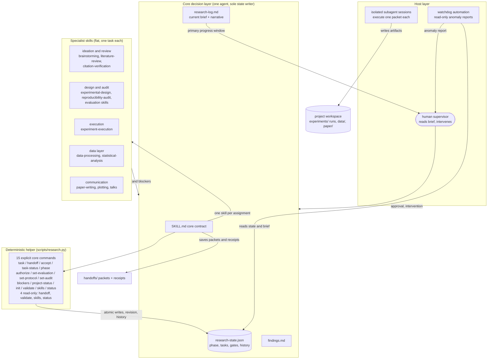
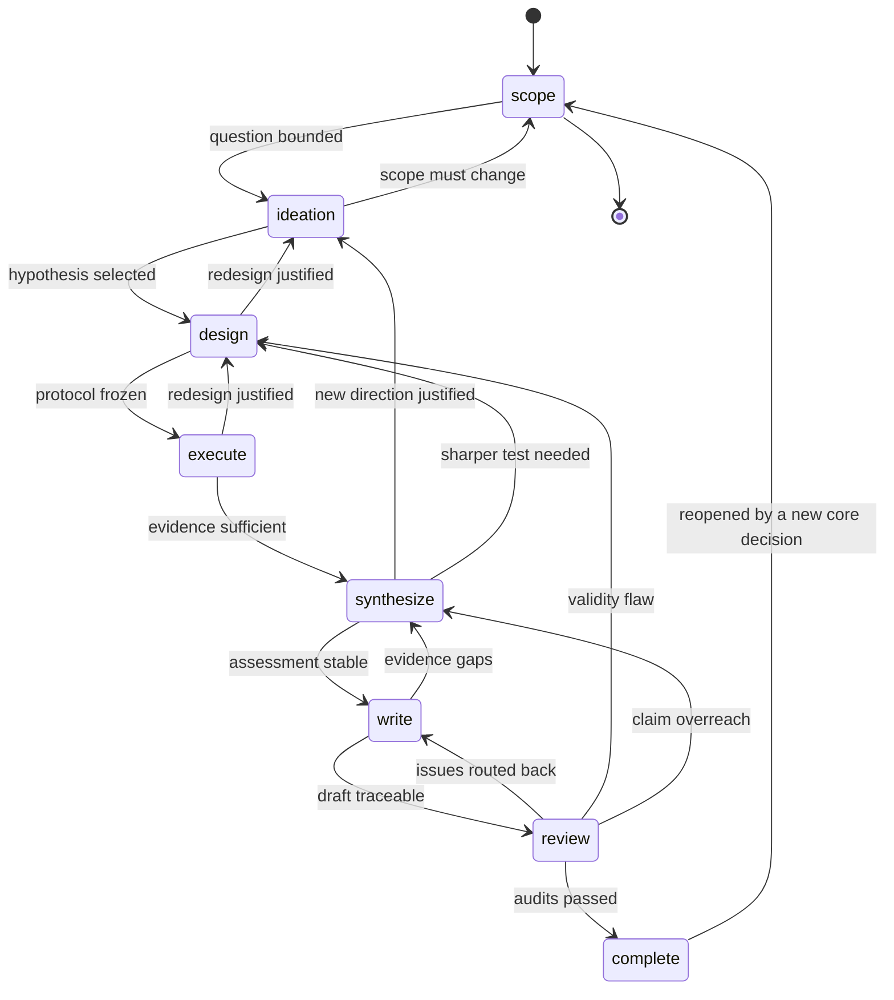
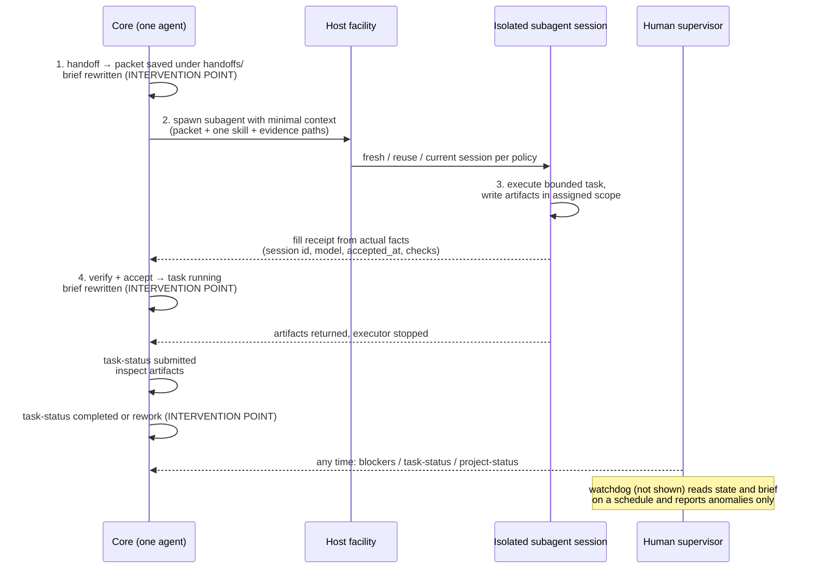
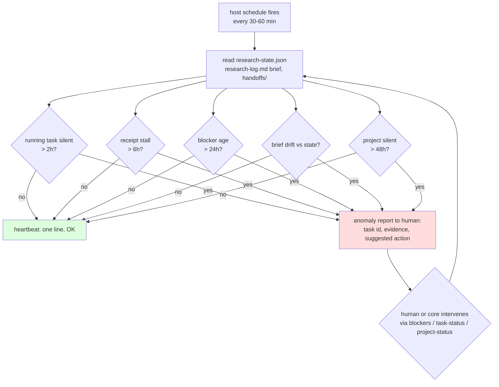

# Framework and Flow Diagrams

One-page visual contract of the framework. Text remains authoritative; these diagrams orient new readers and serve as the map when navigating [the core contract](../SKILL.md), [operations](operations.md), and the [host bridge](host-bridge.md).

## 1. Framework architecture

Three layers with strict downward dependencies: the core decides, specialists execute bounded tasks, and the host provides execution resources and supervision. Nothing in a lower layer writes upward.

Key invariants visible in the diagram:

- Only the core writes `research-state.json`, `research-log.md`, `findings.md` and `handoffs/`.
- The helper implements core decisions; it dispatches nothing and schedules nothing.
- Specialists never call each other, never spawn agents, never touch global state.
- The watchdog only reads; it reports to the human, never to the loop.

## 2. Research flow across phases

Phases are goals with exit criteria, not a task pipeline; each phase holds multiple tasks. Only a separate core `phase` decision moves the project between them.

## 3. Evidence pipeline (the closed loop)

The chain that makes automated research trustworthy: every claim binds back to frozen protocol and raw evidence through checksums and audits.

```mermaid
graph LR
    H[hypothesis] --> P[experimental-design<br/>draft protocol]
    P -->|core freezes| F[frozen protocol<br/>hash recorded]
    F -->|experiment gate<br/>mode + evaluation fields| E[experiment-execution<br/>runs in assigned sandbox]
    E --> R[raw results<br/>runs/run-id/results]
    R --> D[data-processing<br/>clean, validate, manifest]
    D --> M[data manifest<br/>checksums, drop reasons]
    M --> S[statistical-analysis<br/>pre-specified tests only]
    S --> T[summary tables<br/>confirmatory vs exploratory]
    T --> A[academic-plotting<br/>figures]
    R --> AUD[evidence audit<br/>subjects = path + sha256]
    M --> AUD
    T --> AUD
    AUD -->|verified| FIN[findings.md<br/>accepted claims]
    FIN -->|final review + manuscript audit| COMP[phase complete]
```

Gates along the chain: the experiment gate (`authorize` + `set-evaluation` + `set-protocol`) guards execution; the verified evidence audit guards any `conclusions` activity; a final review audit guards `phase --to complete`.

## 4. Host bridge execution loop

One iteration per assignment attempt, with human intervention points marked.

## 5. Watchdog supervision

The watchdog never writes, never dispatches, and never decides - it only makes silence visible.
